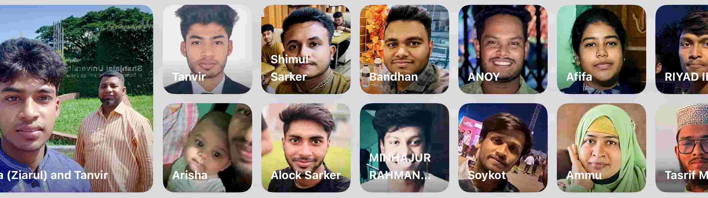

<!--
**Tanvir000Tonoy/Tanvir000Tonoy** is a ✨ _special_ ✨ repository because its `README.md` (this file) appears on your GitHub profile.

Here are some ideas to get you started:

- 🔭 I’m currently working on ...
- 🌱 I’m currently learning ...
- 👯 I’m looking to collaborate on ...
- 🤔 I’m looking for help with ...
- 💬 Ask me about ...
- 📫 How to reach me: ...
- 😄 Pronouns: ...
- ⚡ Fun fact: ...
-->

I am Tanvir Rahman Tonoy, an ambitious student from Dhaka, Bangladesh, with a lifelong passion for science and technology. From an early age, my curiosity about the world around me fueled my desire to explore and learn more about these fields. I completed my higher secondary education in 2023 with a focus on science, achieving outstanding academic results. Throughout my academic journey, I consistently ranked among the top 5% of students during both pre-school and school, excelling in mathematics and problem-solving. 

I successfully passed all major public examinations, including SSC and HSC, with exceptional grades, further showcasing my aptitude in analytical and logical thinking. My fascination with computers and technology has driven me to delve deeper into coding and develop solutions for real-world challenges. I am eager to contribute my skills, collaborate with like-minded individuals, and make a meaningful impact in the field of technology.

Right after me (in the right hand side)  it's Shimul Sarker one of my buddy. We used to study together in school period. We spent a lifetime together talking about technology and innovation. Right after that it's Bandhan Sarker , a very helpful personal to be honest. He accompanied me in alomst all path I took. From my high-school to college and now in my overseas education journey. In the same column below Bandhan It's Minhazur Rahman Tamim , he is such a person who knows me the best and we grew together. From the playground of our kindergarten school to the field of Amirjan College he was one and only person who cheered me up later my Mom. Alock , Anoy , Saikat datta all of them are special peronals in my tiny life. Riyad and Tashrif are my college friends, I can't envision a day without them in my College period. And last but not least Afifa my cordial sister and Ammu , they are the reason I'm breathing. They let me believe that life is full of surprises. And My Dad (Ziarul) without whom I'm nothing , my owner , my love , my everything. Here you go. You know me know , Right! 

    Welcome to my Profile There  

